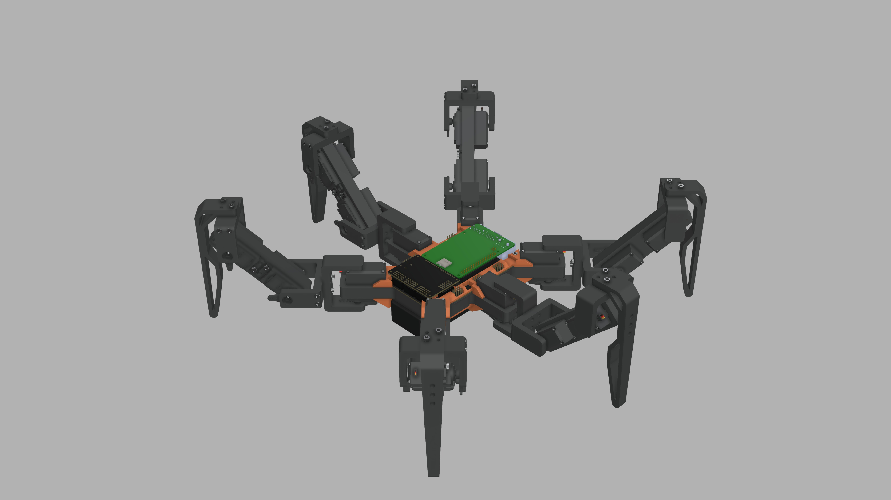
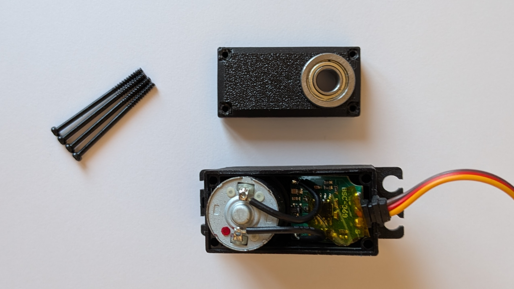
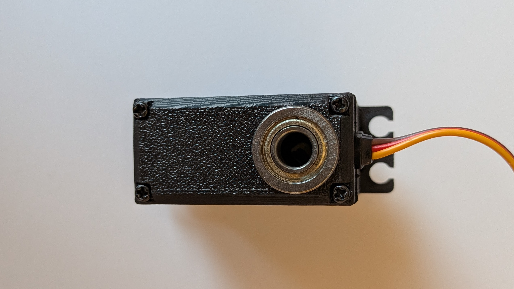

# Hexapod Hardware

    

This repository contains the 3D-printed parts, BOM and assembly guide to replicate my hexapod robot. 

For a complete overview of the project, refer to the [main Hexapod repository](https://github.com/ggldnl/Hexapod). Additionally, you may want to check out the repositories containing the [Controller](https://github.com/ggldnl/Hexapod-Controller) and [Servo2040 firmware](https://github.com/ggldnl/Hexapod-Firmware).

## 🖼️ Render

A fusion 360 render can be found [here](https://a360.co/3SQCzxe).

## 📋 Bill of Materials

Below is a summary of the components required to build the hexapod:

| Category | Component | Quantity | Notes | Cost per part |
|----------|-----------|----------|-------|---------------|
| Mechanical Components | 3D-printed parts | | 6 x `tibia`, 6 x `femur`, ... (refer to the [assembly instructions](#-assembly-instructions)) | |
| | M3 Screws | 92 |  | I bought an assorted 800pzs kit on Amazon for about 12€ and used different screw sizes from the kit. It's not important as long as they fit |
| | F686ZZ Bearings | 18 | You will need one for the back of each motor | About 10€ for 20pzs on Amazon |
| | M3 Heat set inserts | 92 |  | I bought a 150pzs kit on Amazon for about 10€ |
| Electronics | MG996/MG996R Servo | 18 | MG996R are cheaper but less powerful than MG996, they will do nevertheless | About 70€ on Aliexpress |
| | Servo2040 | 1 | An equivalent board can be used instead e.g. 2x Pololu Mini Maestro | About 28€ on the Pimoroni website |
| | Raspberry Pi 5 | 1 | Other versions can be used | About 100€ on Amazon |
| | 7.4V 2S LiPo Battery | 1 | They are often sold in pairs, so I ended up buying two of them for 50€ | About 25€ on Amazon |
| | 8A UBEC | 2 | You will need two of them, one for the servos and one for the electronics. I used [these ones](https://it.aliexpress.com/item/1005007467083035.html?spm=a2g0o.order_list.order_list_main.58.21ef3696TOL15v&gatewayAdapt=glo2ita): they have two channels with selectable input voltage and a power button. The `battery_mount` has two slots to hold this kind of UBECs. If you use a different model, you will need to redesign the part | About 20€ each on Aliexpress |

Approximate total cost: around 280€.

The prices listed in this BOM reflect the costs at the time of purchase and may no longer be accurate. This BOM is provided for reference only and should not be considered a precise cost estimate.

All above components are mandatory. There are two supported assembly paths, depending on whether you choose to use a [custom PCB I designed](https://github.com/ggldnl/Hexapod-PCB) or not.

1. With custom PCB

    Using the custom PCB slightly increases cost (about 60-70€ more) but simplifies the build, keeps the body slim, acts as a rigid base plate and saves you from having to deal with manual wiring. Refer to the [Hexapod PCB repository](https://github.com/ggldnl/Hexapod-PCB) for more information.

    The PCB is totally optional and you can skip it if you want to save a few bucks, but I highly recommend it.

2. Without custom PCB

    If the PCB is not used, the electronics can still be assembled, but with some compromises and additional parts. You will need to:

    - print the adapter plate `electronics_mount.stl` to mount the Servo2040 and Raspberry Pi. The result will be bulkier and with wires all over the place;
    - buy wire extenders as the rear legs are too far from the Servo2040;
    - buy M2 heat-set inserts and M2 screws (Servo2040 mounting holes are 2.7 mm);

    Once you have the necessary, add the M2 heat set inserts to the smaller holes in the `electronics_mount.stl`, secure the two boards and connect them according to [this guide](https://github.com/ggldnl/Hexapod-Firmware)

## 🖨️ 3D Printing Profile

Print profiles and STL files for the robot parts are [hosted on MakerWorld](https://makerworld.com/models/2655972-hexapod).

Make sure to follow the recommended print settings for optimal strength and fitment
Don't forget to boost the project!

## 🔨 Assembly Instructions

Each step below includes a short video.

1. Servos require a minor modification: replace the bottom section of the plastic housing with the custom 3D-printed part designed to hold an F686ZZ bearing, `servo_mod.stl`. This modification is fully reversible. I also added a small piece of kapton tape between the bearing and the circuit for good measure. You can reuse the same screws to secure the 3D-printed part in place. 

    <table>
        <tr>
            <td align="center">
                
            </td>
            <td align="center">
                
            </td>
        </tr>
    </table>

2. Add heat set inserts to the 3D-printed parts. In some places I modeled 4 holes for the heat set inserts (servo hubs and brackets), but then only used 2. I didn't encounter any problems.

    <video src="https://github.com/user-attachments/assets/342bcc59-8d65-4aa1-9488-e9e4fd77accb"></video>

3. Now the legs. You will have to build 6 of them.

    <video src="https://github.com/user-attachments/assets/05f1056e-435a-43d8-accc-99606f1da784"></video>

4. Connect all the legs to the base.

    <video src="https://github.com/user-attachments/assets/e5f85936-af69-40fa-94dd-71543b65fb09"></video>

5. Add the electronics. Top and bottom stiffeners are NOT optional: they prevent the base from flexing. Ensure they actually touch the servos. Higher infill could also help.

    <video src="https://github.com/user-attachments/assets/8699bbb7-0d47-4d19-a4cc-e40c626c33b0"></video>

6. Power the robot.
- Use one UBEC to power the Raspberry Pi/Servo2040. If you use the custom PCB, it exposes a connector for that. Ensure the UBEC outputs 5V, otherwise you will fry the boards. If you don't use the custom PCB, you can use the exposed pins on the Pi; the Servo2040 will get power from the UART connection. 
- Use the other UBEC to power the servos through the terminal block on the Servo2040. Servos can be powered at 6V (check their datasheet just in case).

## 📝 Notes

1. All the legs use the same basic components (`CAD/stl/parts`): `femur.stl`, `tibia.stl`, 3 x `bracket_A.stl` and 3 x `bracket_B.stl`.
2. You will need 12 x `servo_mod.stl`, one for each servo. The mod is fully reversible. 
3. Files in the `CAD/stl/hardware` folder (`MG996.stl`, `battery.stl`, `electronics.stl`, ...) are used in the URDF for simulation, you don't need to print them. Refer to the [assembly instructions](#-assembly-instructions).
4. If you don't want to use the custom PCB, you will need to print the `CAD/stl/parts/electronics_mount.stl` and buy some more components (M2 heat set inserts and screws). Refer to [this section ](#without-custom-pcb).
5. You can edit the printed parts to your likings. STEP files are in the `CAD/step/parts` folder.

## 🤝 Contribution

Feel free to raise issues or contribute improvements to this repository. For further information about the project, check out the [main Hexapod repository](https://github.com/ggldnl/Hexapod). Give a ⭐️ to this project if you liked the content.
